<h1 align="center">Wallace Garcia dos Santos</h1>

<p align="center">
 Support Analyst • Fullstack Developer • Cloud Student • Oracle Cloud Infrastructure Enthusiast
</p>

<p align="center">
  <a href="https://br.linkedin.com/in/wallace-santos-670347386?trk=profile-badge">
    
  </a>

  <a href="https://github.com/wallacesantos19">
    
  </a>
</p>

<p align="center">
  
</p>

---

# 👨‍💻 About Me

```yaml
Name: Wallace Santos

Focus:
  - Cloud Infrastructure
  - Monitoring & Automation
  - Docker & Linux

Currently Learning:
  - Java Spring Boot
  - Oracle Cloud Infrastructure
  - Grafana + Prometheus
  - React Native

Goals:
  - Enter the technology market
  - Become a Cloud analyst
  - Improve backend architecture skills
```

🚀 Tech Stack
<p align="center">  </p>

🏆 Certifications
<p align="center">
  
  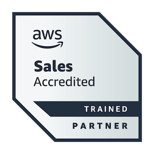
  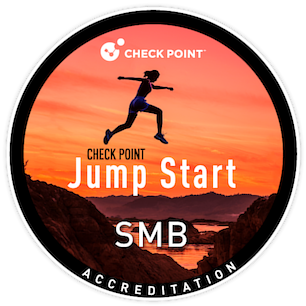
  
  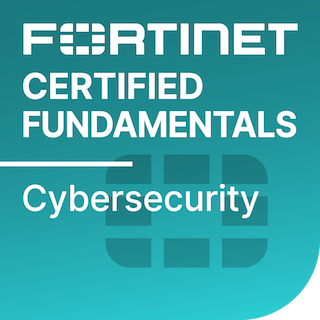
  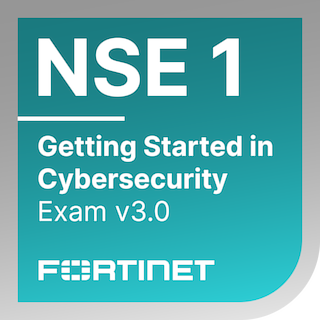
  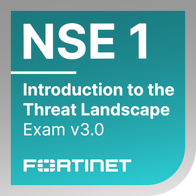
  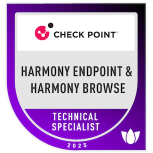
  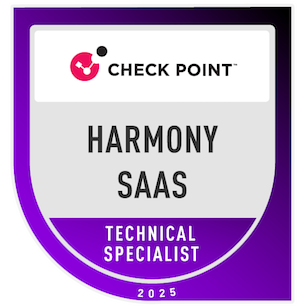
  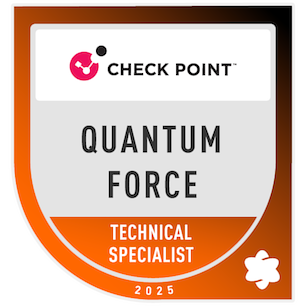
  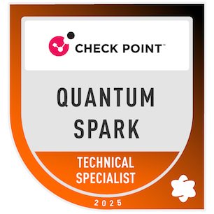
  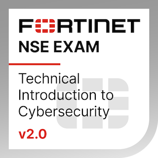
  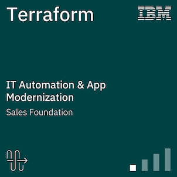
  
  
</p>

🔥 Contribution Streak & Contribution Cards
<table align="center">
  <tr>
    <td>
      
    </td>
    <td>
      
    </td>
  </tr>
</table>


🐍 Contribution Snake Animation

<p align="center">
  
</p>
